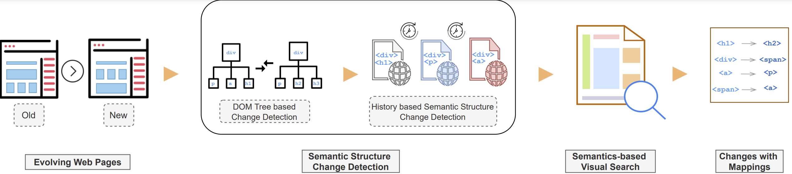

# WebEvo
Implementation of the paper WEBEVO: Taming Web Application Evoluation via Detecting Semantic Structure Changes.
## Introduction
WebEvo combines two main modules to find semantic structure changes occuring between different versions of a web page. First module is called the Semantic Structure Change Detection module. The module first performs DOM-tree based change detection by comparing the DOM trees of two pages to find content-based changes and structural changes. Then the detected changes are further pruned via our History-based semantic structure change detection technique to output only semantic structure changes. Finally, these detected changes are used as input to our Semantics-based visual search module, which outputs the semantic structure changes with their mappings using content similarity analysis.


## Requirements
+ JAVA Version: 1.8
## Usage
The major modules of WebEvo are listed below:

### Semantic structure change detection module.

##### DOM-tree based change detection.

This module detects whether a part of the web page has changed using Levenshtein Edit Distance to compare the attributes and the structure of the corresponding DOM-trees. The inputs of DOM-tree based change detection module are the target page and the evolved page, the output contains changes in the DOM tree structures.

+ Input:

The target page and the evolved page.

+ Ouput:

Changes in the DOM tree structures.

To run the jar file:
```bash
java -jar api-monitor-0.0.1-SNAPSHOT-jar-with-dependencies.jar -oldpage: <targetpage> -newpage: <evolvedpage>
```

api-monitor-0.0.1-SNAPSHOT-jar-with-dependencies.jar is in [DOM-tree-based-change-detection](DOM-tree-based-change-detection).

##### History-based semantic structure change detection.

The goal of this module is to prune the content-based changes from the previous step to find only semantic structure changes. We define content-based chagnes as web contents being constantly updated based on what a web server delivers to the client browser. This types of changes usually do not cause RPA or test scripts failures therefore need to be identified and filtered. 

We compare the target page with its historical pages to identify the content-based changes.

+ Input:

The target webpage and three historical pages.

+ Output:

"dynamic.txt" contains the XPaths associated with the labels, which indicate whether the XPaths are dynamic or static.

To run the jar files:
```bash
java -jar api-monitor-0.0.1-SNAPSHOT-jar-with-dependencies.jar -oldpage: <targetpage> -historypage1: <historypage1>
-historypage2: <historypage2> -historypage3: <historypage3>
```

api-monitor-0.0.1-SNAPSHOT-jar-with-dependencies.jar is in [History-based-change-detection](History-based-change-detection).

+ Example:

Apple website -  In the output (dynamic.txt) of History-based semantic structure change detection module, the promotion section in the target page is identified as a content-based change (dynamic  /body/main[1]/section[2]) because it is constantly updated in a very short period of time, therefore it will not be passed to the Semantics-based Visual Search module to have further analysis.

<table>
  <tr>
    <td>The promotion section in the target page:<br></td>
    <td>The promotion section in the historical page:<br></td>
  </tr>
</table>

### Semantics-based Visual Search
This module focuses on detecting the elements which have their locations changed in the web pages. Rather that analyzing the screenshots of whole web pages, WebEvo obtains the screenshots of the candidate changes and combines both text and image similarities to identify mappings between the original elements in old web page and the changed elements in new web page. The source code is in [graphic-image-analysis](graphic-image-analysis). Please check out [README.md](graphic-image-analysis/README.md) for the usage.

### Experiment Steps and Results
The experiment steps and the results are in [Results](Results). Please check out [README.md](Results/README.md) for more details.

+ Example:

The location of the link "EXAMPLES" on w3schools is different between the target page and the evolved page.

The location on the target page:


The location on the evolved page:


By DOMTree-based change detection module, the "EXAMPLES" link is incorrectly marked as "NODE_REMOVED". Semantics-based Visual Search can fix this error, it correctly identifies this link on the evolved page. Refer to [target screenshot](Results/w3schools/target_img/target130.png) and [evolved screenshot](Results/w3schools/candidate_img/target130_folder/candidate1.png).

## Acknowledgement
[Vista](https://github.com/saltlab/vista)


